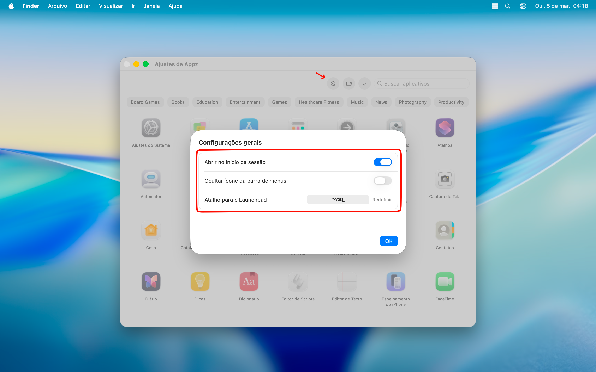
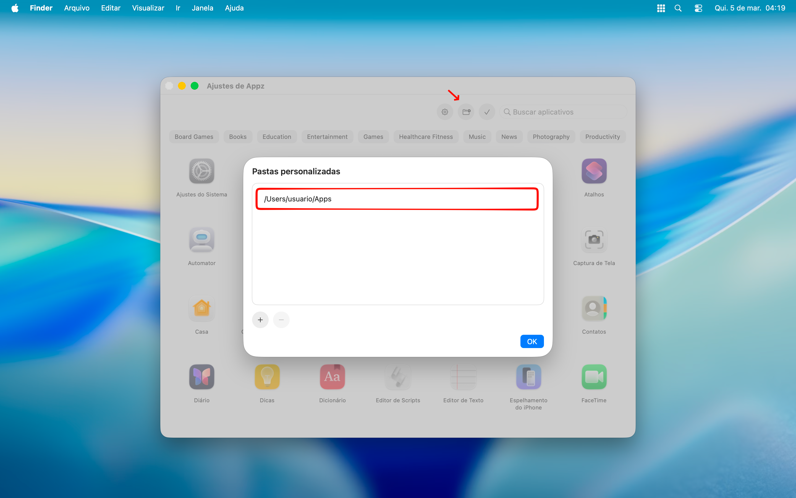
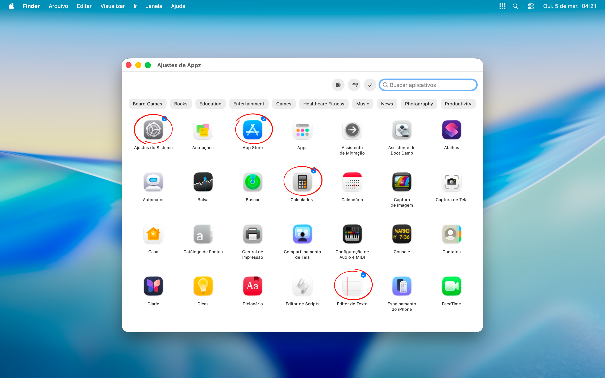
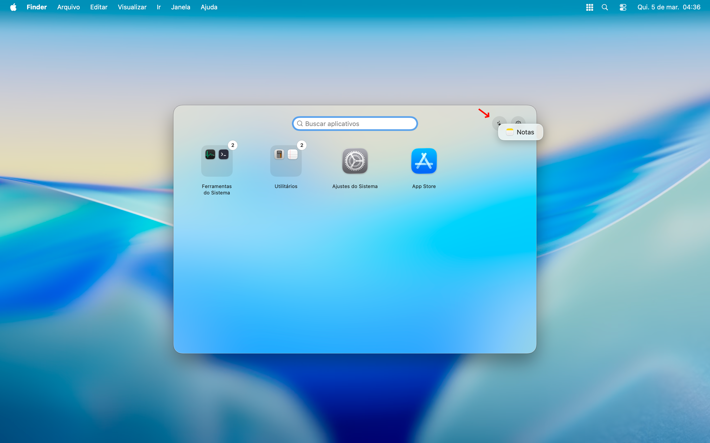
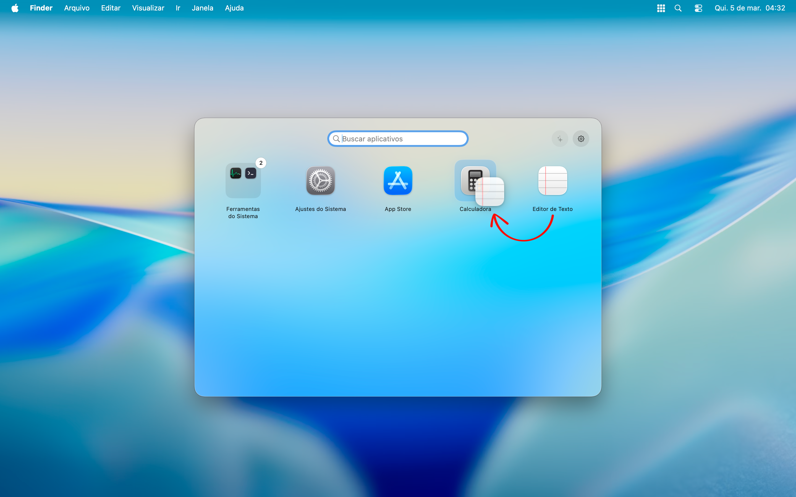

# Appz

**Appz** é um launcher de aplicativos para macOS focado em produtividade, exibindo apenas os favoritos do usuário e permitindo acesso rápido pela barra de menus e por um atalho global.

## Índice

- [Recursos](#recursos)
- [Ajuda](#ajuda)
  - [Configurações gerais](#configurações-gerais)
  - [Pastas personalizadas](#pastas-personalizadas)
  - [Escolha os favoritos](#escolha-os-favoritos)
  - [Sugestões](#sugestões)
  - [Grupos](#grupos)

## Recursos

- **Barra de menus**: tenha seus aplicativos favoritos disponíveis na barra de menus do macOS.
- **Launchpad**: acesse o Appz de qualquer lugar com um atalho global.
- **Grupos personalizados**: organize seus aplicativos em grupos no Launchpad.
- **Arraste e solte**: crie novos grupos ou adicione aplicativos nos grupos existentes.
- **Aplicativos sugeridos**: receba sugestões dos aplicativos mais usados para facilitar seu fluxo.
- **Ícone da barra de menus**: mantenha a interface mais limpa ao ocultar o ícone da barra de menus.

## Ajuda

### Configurações gerais

Nos ajustes do Appz, acesse as configurações gerais e escolha se deseja permitir que o Appz abra no início da sessão, ocultar o ícone da barra de menus ou personalizar o atalho global do Launchpad.

### Pastas personalizadas

O Appz busca os aplicativos instalados no seu Mac, mas você pode adicionar pastas personalizadas contendo os aplicativos que não foram instalados no sistema.

### Escolha os favoritos

Clique no aplicativo para marcá-lo como favorito. Clique novamente para desmarcá-lo.

### Sugestões

Os aplicativos usados com maior frequência que não foram definidos como favoritos serão sugeridos pelo Appz; aceite ou ignore a sugestão.

### Grupos

Os grupos ajudam a organizar os aplicativos no Launchpad. Você pode criar grupos arrastando um aplicativo sobre o outro.

